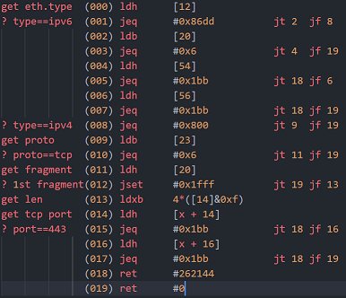

+++
title = "BPF技术介绍 - 生态和历史"
[taxonomies]
tags = [ "Linux" ]
+++

## BPF技术介绍 - 生态和历史

本文图片都源于网上公开资料，未注明来源。内容源于对网络检测与响应NDR的开发。

### 历史成因


图1：Linux内核的代码量增长

### DPDK、PF_RING和BPF的共同点
分离出网络的数据平面
- 网络功能扩展的代价是牺牲性能
- 都在突破内核复杂度的限制 -kernel bypass
- 从内核中分离出数据平面
- 向上交给用户态开发 -DPDK、PF_RING和BPF
- 向下卸载到网卡执行 -BPF的XDP

### DPDK、PF_RING和BPF的差异点：生态目标不同
 DPDK
- DPDK 独立的平台
  - 独占内核网络栈
  - 专用的SDK API
  - 生态面向硬件
  - 应用隔离和安全机制失效
- PF_RING 独立的厂商
  - 独立的意大利公司
  - 高性能版独立收费
  - 独立的生态

 BPF
- BPF 融合的生态
  - 嫁接在内核中
  - 融合在已有的软硬件中
  - 生态面向软件并发展迅速

### DPDK与BPF基金会
面向基础设施：底层硬件 / 上层业务


图2：两种不同利益的基金会

### DPDK年度事件和技术标准
年度事件
- 2010，Intel，Xeon 1代的DPDK
- 2013，6WIND，DPDK.org社区
- 2014，OvS，OvS-DPDK分布式虚拟交换机
- 2015，ARM版本
- 2017，加入 Linux 基金会
- 2018，VMware，数据中心内软件定义基础结构
- 2019，金融应用(高频交易)

技术标准
- PCI passthrough，绕过Hyper-V模拟，虚拟机直通PCI
- SR-IOV，绕过 Hyper-V堆栈，单网卡虚拟成多张直通网卡
- FD.io/VPP，矢量加速数据IO，减少I-cache抖动和读延时
- vDPA， virtio 数据路径加速，控制面软件模拟，数据面硬件实现
- Switchdev，卸载内核的交换功能到硬件
- 代码贡献占比 (V21.11)

## BPF迅速发展的生态 
年度技术
- 1992 论文，BSD Packet Filter
- 1994 cBPF，tcpdump中libpcap的实现
- 2014 eBPF，通用虚拟机
- 2015 BCC，开发工具和库
- 2016 XDP，网络内核旁路模块
- 2017 libbpf，脱离内核独立发展
- 2017 ARM/MIPS，多平台BPF
- 2018 BTF，跨内核版本类型格式
- 2019 尾调用和热更新
- 2020 LSM和TCP拥塞控制
- 2021 eBPF基金会

产品生态
- 2017 Facebook，生产环境中的负载均衡Katran
- 2018 Cloudflare，生产环境中的DDoS/防火墙等
- 2018 Android 9，流量监控，包括DHCPClient
- 2018 Netronome，Agilio智能网卡支持XDP
- 2018 DPDK，支持BPF(不包括MAP和尾调用)
- 2019 Google，KRSI 内核运行时安全助手(Kernel V5.7)
- 2019 Sysdig，Falco捐赠为k8s安全基础
- 2020 Nvidia，Mellanox智能网卡支持XDP(￥3千~9千)
- 2020 微软，Linux版Sysmon，eBPF for Windows
- 2020 字节，高性能网络 ACL
- 2020 阿里云，基于Cilium加速和扩展
- 2021 Cilium，Service mesh (无Sidecar)

### DPDK与BPF生态
面向生态和开发者不同

产品分类    | DPDK                  | BPF
-----------|-----------------------|------
安全       |                        | Falco/Cilium/L4drop/...
可观测性    |                       | Hubble/L3AF/Tracee/...
网络       | DPVS/OVS/FD.IO/VPP     | Katran
SDKs       | C++/GO                 | C++/Rust/GO/Python
内核       |TCP栈 F-Stack/mTCP      | helper-API/Maps/Verfier&JIT
市场生态   | 关注硬件能力的虚拟化和共享，硬件厂商推动，是虚拟化技术vt-x/ept等在网络IO上的演进 | 关注内核能力的分离和复用云厂商推动，是云原生技术演进对本地生态的融合

表1：两种不同利益的基金会


## BPF技术介绍 性能分析

### DPDK与PF_RING技术异同  - 技术相近


图3：PF_RING原理


图4：DPDK模块结构

相同
- UIO+PMD主动轮询 减少中断和CPU上下文切换
- UIO+mmap 实现零拷贝
- HugePages 减少TLB 失效

差异
- PF_RING 分普通版和ZC(zero copy)高性能版本
- ZC许可证收费，DPDK 免费
- ZC与DPDK的性能基本持平
- ZC应用层API易于使用，开发难度远小于DPDK
- ZC是意大利ntop公司下的一款产品，生态小

### BPF的网络技术特点 


图5：BPF模块结构

BPF的7种挂载点，覆盖全生命周期流程
1. uprobe
1. syscall
1. sockmap/sockops
1. kprobe
1. cgroups
1. tc
1. xdp


图6：BPF的XDP程序的4种包处理方式

XDP的4种包处理方式
1. PASS 放行到kernel 
1. DROP 丢弃，不到kernel
1. REDIRECT 转发其他处理
1. TX 原路返回(用于阻断和重定向)

### XDP的卸载网卡性能 
Netronome智能网卡数据
- XDP 3个hook点(网卡Offload/内核前Native/内核中Generic)
- Offload 1 core比Native 8 core快近似1/3倍
- Native下比DPDK稍慢，性能相差不多 Stackoverflow  Redhat


图7：XDP的3种挂载模式的性能


图8：XDP在网络协议栈的位置

### NAC压测记录 
3种类型的吞吐率,NAC WSL2虚拟机

XDP_DROP 直接丢弃
```sh
❯ tcpreplay -t -i lo t.pcap
Actual: 56320 packets (46419288 bytes) sent in 1.10 seconds
Rated: 42062496.6 Bps, 336.49 Mbps, 51033.95 pps
Flows: 1091 flows, 988.60 fps, 56290 flow packets, 30 non-flow
```

XDP_TX 阻断、重定向
```sh
Actual: 56320 packets (46419288 bytes) sent in 1.30 seconds
Rated: 35446666.1 Bps, 283.57 Mbps, 43007.04 pps
Flows: 1091 flows, 833.10 fps, 56290 flow packets, 30 non-flow
```

XDP_TX + map_perf 阻断并上报应用
```sh
Actual: 56320 packets (46419288 bytes) sent in 1.49 seconds
Rated: 31016641.1 Bps, 248.13 Mbps, 37632.14 pps
Flows: 1091 flows, 728.98 fps, 56290 flow packets, 30 non-flow
```
竞品 10个千兆电口,每秒事务数1000TPS，最大吞吐量500Mbps，最大并发连接数:1000(条)

### BPF技术介绍 - 案例分析
实际案例 cloudflare DDOS 
Mirai僵尸网络的3次攻击


图9：DDOS时网络承载的流量

2020.07， 654Gbps， SYN 洪水和UDP 洪水 
2021.08 ，1.2Tbps， SYN 洪水和UDP 洪水，最大HTTP请求2500万次/s , 3 秒内被阻止
2021.11， 2Tbps， 1分钟的DNS 放大攻击和 UDP 洪水，1.5 万个僵尸 （下图）
近2Tbps


DDOS缓解流程 
生态链：全BPF系列产品集成


图10：缓解DDOS时使用XDP的工具链

- 接收样本分析到攻击时自动推送缓解策略
- 再在每台服务器上执行本地缓解策略,
- DDos的L4Drop (XDP)
- LB的Unimog     (XDP) 
- 防火墙的Magic firewall (BPF xt_btf)
- 分发和监视
- UDP限速 (BPF SO_ATTACH_BPF)
- 上报指标的ebpf_exporter


图11：缓解DDOS时使用XDP的协议找技术

### p0f指纹库说明 TCP header特征
DDOS流量指纹识别 

指纹类型
```
Windows XP: 4:120+8:0:1452:65535,0   :mss,nop,nop,sok   :df,id+:0
Windows 7:  4:128:0:*     :8192,8    :mss,nop,ws,nop,sok:df,id+:0
Windows 11: 4:128+0:0:1460:mss*44,8  :mss,nop,ws,nop,sok:df,id+:0
ubuntu 14:  4:64   :0     :*:mss*10,6:mss,sok,ts,nop,ws :df,id+:0
```

TCP指纹 判断依据，Linux的TTL为64，Win是128，flags的数量和位置，Linux与Win不同
```
4: IP version 
  64: TTL   
     0: IP options length
       *: MSS maximum segment size
         mss*10,6: TCP window size and scale
                  mss,sok,ts,nop,ws: TCP Options(sok:selective ACK permitted)
                                 df,id+: quirks(df: don't fragment)
                                        0 TCP Payload Length
```


### 负载均衡中的流量标识
Facebook katran TCP option添加自定义ID


图12：负载均衡时XDP在L4层与其他服务间的关系

- 通过将server_id加在TCP头中实现无状态路由机制
- 处理TCP头额外开销(CPU/memory)非常小
- 根据server_id使用Maglev Hash变种选择后端
- 只适用于无防火墙的内网

拦截事件点读写server_id


图13：XDP在L4层负载均衡时用到的事件

### 可观测性 调试
cilium pwru (packet, where are you?)

跟踪内核中的网络包的API调用

### BPF技术介绍 - 技术分析
BPF开发运行机制


图14：BPF生命周期流程(网络的XDP和TC)

1.编写、编译
2.校验
3.BPF字节码到机器码
4.挂载执行
6.与系统通信
5.XDP的DROP/PASS/TX/REDIRECT


### cBPF虚拟机原理


图15：代码在编译器的分解


图16：BPF转换成DAG

BPF 基于寄存器虚拟机，程序最终转换成一个DAG，并由内核来执行
过滤器表达式在两种模式下的编译分解，见下图
模型1: 制约性能最大的问题，有重复计算
模型2: 等价于模型1，只需6次布尔运算，遍历完整棵树
模型2 eBPF
模型1 cBPF

### cBPF虚拟机执行流程


图17：BPF内部执行流程


图18：BPF指令码解释

$ tcpdump tcp port 443 -d

### BPF现有问题
内核版本和安全

- 内核版本支持 Linux > V4.18
- XDP及其MAP的支持
- BTF跨不同版本内核运行
- 安全 提权漏洞 Linux V5.7~V5.8
- CVE-2020-27194：Verify时越界读写造成
- CVE-2020-8835：Verify时常数变量取值范围的逻辑错误
- CVE-2020-27194：Verify时寄存器边界跟踪
- 容器逃逸: 编写Rootkit，修改用户空间，hook网络数据
