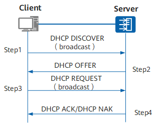

+++
title = "开发minidhcp的感受记录"
[taxonomies]
tags = [ "Linux" ]
+++

## 开发minidhcp的感受记录

开发此服务目的是为网络流量分析和控制提供一种支持手段。具体方法是增加基于角色分配IP段的dhcp，并记录分配的设备的信息。

为了快速验证，在github上找到了[coredhcp](https://github.com/coredhcp/coredhcp)，去掉了dhcp6及其繁冗的插件系统，优化重构了网络收发部分代码，重写了option的分配，加入了基于角色分配IP的功能，角色策略通过配置文件生效。[^1]

## dhcp协议流程

[^2]

### DHCP lease 生命周期
流程类似打工人租房，先电线杆子广播需求，收到房源电话后签合约，住到期后再续租。

在DHCP协议里描述的更严谨，用编程语言描述就是会有多个if else。

在计算机网络里会是一来一回的消息请求和确认。

类似盲人摸象，不同的视角说的都不全面。

用语言描述如下：
1. 此前没有过IP的客户端全网广播向DHCP服务申请，通过后分配一个IP时间限制的租约
2. 已有过IP的客户端向授予它租约的DHCP服务器联系，以确认为其重新分配租约
3. 租约过期后，客户端将联系最初授予租约的服务器续租
4. 如果续租失败，客户端将尝试重新绑定到任何活跃的DHCP服务器
5. 客户端主动放弃租约下线(goodbye curel world😢)

以上5步在DHCP服务认知的世界里，用Allocation、Reallocation、Renewal、Rebinding和Release来描述。

当然在租房客的认知世界里，憧憬未来和负重前行也与房东的5步相对应。

### 先说协议的Allocation，大家共同遵守同样的约定
1. client --DISCOVER(myMac, myID)--> servers
2. client <--OFFER(yourIP, your[DNS,Router,Mask,...], yourID)-- servers
3. client <--IP[x]-- [1, n]IP from OFFER list 
4. client --REQUEST(IP[x])--> servers
5. client <--ACK/MAK-- server

用语言描述为
1. 广播找房
2. 广受青睐，发来房源信息
3. 挑选1个高性价比的房
4. 广播告知自己已是有房之人
5. 房东送来租房合同等你签字

色不异空，空不异色，Reallocation、Renewal、Rebinding亦复如是

## server网络收发细节
- 服务端监听在67端口上，收到client请求后解析有icmp的信息，响应给client容错时要处理下，里面有网卡接口可以使用
- 对普通请求，响应原路2层ethernet返回。其他非正常消息在3层ip上icmp返回错误提醒
- 具体的发送使用libpacp，发送前要去掉自定义链路层的协议头部

## options种细节
DHCP通过自定义增加多种不同的可选项来扩展，服务端返给客户端的option里有[ip, dns, mask, router, serverID...]可自由添加。
- 分配时先根据客户端的mac来识别其角色，再根据配置文件中的range来分配具体的ip等信息
- 其他扩展在options的HandlerXXX dispatch去即可
- 需要客户端信息的，再options里可以对其提出，比如Vendor信息等
- 续租等信息在lease.txt可查可用
- 分配算法用的coredhcp的bitmap方式降低内存占用

[^1]: [源码地址](https://github.com/jimluo/minidhcp)
[^2]: [图片来源](https://support.huawei.com/enterprise/zh/doc/EDOC1100156651/bb57bdaa/how-dhcp-works)