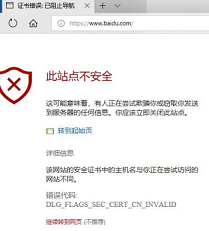
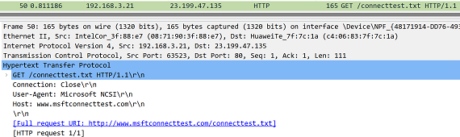
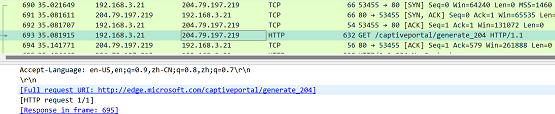

+++
title = "HTTPS下强制认证"
[taxonomies]
tags = [ "Linux" ]
+++

网络安全准入对终端设备最开始和直接的就是强制其认证合法性。

原有基于HTTP重定向认证已失效，因为HTTP不安全。且浏览器都强制HSTS技术只能HTTPS。

怎么在HTTPS下还能重定向来认证？

住宿酒店和搭乘飞机时会对我们有所启发。接入提供的免费WIFI后会重定向。

结论就是诱使OS发出HTTP。


### 技术背景
网络准入产品可以验证终端设备是否安全，使用强制网络门户认证技术实现此验证
1. 强制网络门户认证(captive portal），终端入网后，强制弹出浏览器的认证页面，强制用户认证后使用网络
2. HSTS(HTTP Strict Transport Security), 防止MiTM中间人攻击，浏览器强制使用HTTPS与服务器创建连接，用户无法发出HTTP请求
3. Captive Portal实现依赖于阶段性的HTTP劫持，当设备入网后，通过DHCP服务获取本机IP地址和网关地址后，发出的HTTP请求被劫持后返回重定向到指定的HTTP认证页面

### 存在问题
1. 用户终端入网后先用浏览器手动访问HTTPS网站时，返回给终端浏览器的重定向响应，由于浏览器验证服务器证书不匹配会警告，无法实施强制认证，使此技术方案失效。如图

 

2. 用户终端网络在线时，由管控服务端实施准入策略，在未认证前断网，直到浏览器发出HTTP后被准入服务重定向后去认证。由于浏览器预制的HSTS域名缓存或服务端支持HSTS技术，HTTP被浏览器强制转换为HTTPS，致使浏览器验证服务器证书不匹配会警告，使此技术方案失效
3. 原有准入系统实施基于浏览器http重定向的认证功能，在https下失效，报错证书不匹配，无法实施强制认证，使此技术方案失效。

### 可以利用OS的一个机制
操作系统：Windows/Linux/MacOS/Android/iOS下
刚入网时回探测是否需要认证，先探测有强制门户，再做认证
1. 终端操作系统入网后探测是否处于认证网关之下，多次尝试连接指定的HTTP的url，最长超时 30 秒
2. 如果指定服务返回了204状态码，即未发现强制门户，不需要验证
3. 如果指定服务返回HTTP重定向认证，即强制门户认证，认证后网络放行



图1 OS发出探测



图2 OS收到无强制门户的204状态

以下是部分固定的探测强制门户的url
```
Windows :http://www.msftconnecttest.com/connecttest.txt
Google：http://www.gstatic.com/generate_204 / ， ...
Android:https://www.google.com/generate_204，...    
小米： http://connect.rom.miui.com/generate_204
华为： http://connectivitycheck.platform.hicloud.com/generate_204
```

### 如何利用OS的这个机制
在交换机或浏览器上处理，诱发OS发出强制门户认证探测

两种方案各有优劣，也可同时使用
- 交换机方案依赖交换机的控制，普通服务没有控制交换机的权限
- 浏览器方案依赖用户先打开浏览器


图3 HTTPS重定向的网络拓扑


## 基于交换机的技术方案
1. 准入服务控制交换机对终端断网后再开网
2. 终端重新入网诱发其探测强制门户
3. Windows尝试强制认证，访问http://www.msftconnecttest.com/connecttest.txt
4. 终端桌面上托盘中的网络图标闪烁，提示用户点击图标，会打开浏览器并跳入认证页面
5. 准入服务流量截获HTTP请求并重定向到认证页面
```
终端               交换机        强制门户          准入服务
 |<---断网后再开网----|             |
 |                   |             |
 |-------------探测强制门户-------->|----捕获HTTP---->|
 |                   |             |                 |
 |<------------发送模仿强制门户的重定向认证------------|
```
表1 基于交换机的HTTPS重定向

### 交换机实施控制技术
1. 与终端直连的交换机将终端地址通过snmp trap上报准入服务
2. 准入服务给指定终端断网再入网snmpset  [up / down]

## 基于浏览器证书的技术方案
客户端浏览器	网络通讯	服务器(流量镜像)
1.	浏览器发起请求，例如https://www.wechat.cn
2.	准入服务识别HTTPS请求，生成自签名的ssl证书（可缓存证书重复利用），返回给终端浏览器
3.	准入服务判断证书，包含公钥，颁发者	返回证书给终端浏览器
4.	终端浏览器判定证书字段有误，终止后面数据传输的流程。进入门户认证流程，
5.	发起http请求，寻找门户http://www.msftconnecttest.com/connecttest.txt
6.	准入服务识别请求，修改门户地址，返回给终端浏览器
7.	终端浏览器打开新tab页跳转到指定网址
```
终端               交换机        强制门户          准入服务
 |-----------HTTPS浏览网页时SSL握手验证证书---------->|
 |<----------------发送自签名的ssl证书----------------|
 |---------判定证书字段有误，进入门户认证流程--------->|
 |                   |             |
 |-------------探测强制门户-------->|----捕获HTTP---->|
 |                   |             |                |
 |<------------发送模仿强制门户的重定向认证------------|
```
表2 基于浏览器证书重定向

### 实现特点
1. 解决了现有产品在HTTPS下强制门户认证的失效问题
2. 高性能，同时大并发量下对HTTPS强制门户认证。基于BPF实现
3. 绕过HSTS对HTTPS强制使用，实现HTTPS时也能实施强制门户认证
4. 基于强制门户发出的HTTP探测，还能用于其他安全业务


## 代码目录结构[^1]
```sh
bpf/ 驱动
   lib/ 协议库
      api.h  公用依赖头
      eth.h  以太帧处理
      ipv4.h ip帧处理
      tcp.h  tcp帧处理
      http.h http处理
      dhcp.h dhcp收集终端信息
      os_filter.h  过滤os
      metrics.h  系统性能
   linux/ 内核类型
   test/ 单元测试
   bpf.c 驱动
Makefile   构建
main.go    加载入口
program.go 加载器
maps.go    内核与用户态传参字典
npf.go     驱动上报
npf_bpfel.go  自动生成加载驱动
snmp.go    snmp下启停端口
tracer.go  traceroute查找终端机器直连的交换机
```
## 驱动流程
从2层到5层，eth->ip4->tcp->http
1. 网络入口 xdp_npf_prog(struct xdp_md* ctx)
2. struct pkthdr pkt{data_cursor, data_begin, data_end}数据帧封装
3. 过滤http及重定向
   1. config verify 读取配置，交换机ip等
   2. eth parse and verify, 只留IP包
   3. ipv4 parse and verify, host pkt pass
   4. tcp parse and verify
      1. tcp options filter, find and save token to hashmap
   5. os filter
   6. http parse and filter os
   7. lookup hashmap of token
   8. http parse and verify 
   9.  redirect http  本机debug时关闭


## 加载流程   program.go npf_bpfel.go  
1. cfg := LoadConfig("config") 加载本地配置
1.	npf := NewNpf(cfg) => npf.go 驱动加载
   1.  loadNpfObjects(&bpf) => npf_bpfel.go  初始化
   2.  LoadProg(bpf.npfPrograms.XdpNpfProg.FD()) => program.go 加载
       1. GetIface(linkname) 获取网卡interface
       2. AttachProg(）将启动挂载到网卡interface
   3.  perf.NewReader(PKT_INFO_EVENTS_MAP） 挂载事件  
1.	npf.SetKernelConfig() 构造配置下传
   1. redirectUrlLinux 重定向地址
   2. ipHost  本机地址
   3. macHost 交换机mac
1. npf.Listen() 监听事件
   1. HandleRecord() 解析打印事件

## https重定向流程 snmp.go tracer.go
1. snmpscan() 主入口
   1. NewSnmp(p)
   2. Connect()
   3. QueryIfaces() 获取所有端口
   4. DownUpIface 关接口
   5. UpIface 开接口
2. Trace() 主入口
   1. DefaultTracer 构建可配置的tracer
      1. Trace()
         1. ping
         2. Receive
      2. touch，记录每一跳
      3. Add，判断符合RTT或srcIP后添加
   2. hops，反向过滤所有跳，匹配上过滤


[^1]: [RedirectHTTPS](https://github.com/jimluo/redirectHTTPS)