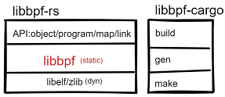
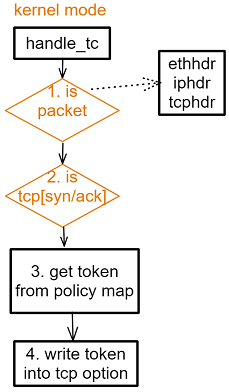

+++
title = "基于Rust和BPF技术的网络TCP水印"
[taxonomies]
tags = [ "Linux" ]
+++

网络水印用于防DDoS攻击和网络流量等安全领域，原理是给报文增加特征信息，基于TCP options的增加字段不会被防火墙等修改去除，本文正是使用BPF和Rust来达到高效的实现的具体描述。[^1] 源码参见[]
**保护知识产权的图片水印不在此列**

- BPF驱动使用c开发
- 用户态的配置和加载器使用rust和libbpf-rs加速开发


## 依赖封装关系


基于libbpf-rs开发, libbpf-rs提供用于开发的API抽象，包括驱动object和其静态程序、通讯、挂载上程序的资源抽象

同时libbpf-sys封装了unsafe的libbpf和libelf、zlib，其中核心是基于内核的一部分libbpf，c开发的静态链接库。细节稠密的api，也加载并解析驱动elf文件使用的动态链接的libelf和zlib

基于libbpf-cargo脚手架生成工程目录，build命令调用gen和make完成

## 工程目录结构
由libbpf-cargo自动生成的骨架目录的代码

```sh
netoken\
  src\
    bpf\                  //驱动
      .output\            //脚手架自动生成
        netoken.skel.rs  //=>libbpf_rs
      netoken.c              ^
      vmlinux.h               |
    main.rs  //=>libbpf_rs    |
build.rs     //=>libbpf_cargo-+
Cargo.toml
libbpf-rs\
  .git
  libbpf-rs\
  libbpf-cargo\
```

Cargo.toml中可配置依赖libbpf-xxx的具体位置
```toml
[dependencies]
libbpf-rs = { path = "../libbpf-rs/libbpf-rs" }
[build-dependencies]
libbpf-cargo = { path = "../libbpf-rs/libbpf-cargo" }
```

## 骨架代码生成流程
1. 用户工程 build.rs->libbpf-cargo.rs SkeletonBuilder() *.bpf.c => .output/*.skel.rs
2. 用户工程生成的*.skel.rs流程: 
   1. obj: DATA [u8]
   2. *SkelBuilder()->Open*Skel()->*Skel(), progs/maps/links
   3. build_skel_config()->ObjectSkeletonConfigBuilder::new(DATA)
   4. builder.name(***).map("").prog("handle_***").build()
3. libbpf-rs 提供用户常用工具
   1. object/skelton
   2. prog/map/link
   3. iter/print/query/util
   4. perf/ringbuf
4. libbpf-cargo 提供cargo build时自动生成skel，gen/make
5. 执行*.skel.rs流程
   1. TcSkelBuilder.open()->OpenTcSkel(obj, config)
   2. OpenTcSkel.load() >> bpf_object__load_skeleton(config)
   3. OpenTcSkel.load()->TcSkel(obj,config, Tclinks())
   4. OpenTcSkel.progs()->OpenTcProgs(obj)
   5. OpenTcSkel.maps()->OpenTcMaps()
   6. OpenTcSkel.data()->ffi::c_void()
   7. TcSkel.attach() >> bpf_object__attach_skeleton(config)
   8. TcSkel.links = TcLinks(handle_tc)
6. libbpf.h typedef struct bpf_object_skeleton bos
   - libbpf将内核bpf_xxx封装到3个struct和4个阶段phase的api，隐藏内核极多的细节
   - error/print/open_opts/
   - bpf_object_open_[buffer/mem/xattr]xxx
   - bpf_object__load/__next/__set/pin/unpin
   - bpf_[program/map/link]__set/load/fd/xxx;__attach_xxx
   - bpf_map__[set/get/find_map]
   - bpf_perf/kprob/uprobe/tracepoint/link_xdp/tc_hook

## 用户态加载流程

1. 解析命令行参数中的网卡名，并获取其系统中的网卡号
2. 使用生成的skelBuilder逐步获取驱动object的内存文件描述符fd
3. 使用生成的hookBuilder创建并将自己hook在网络出入口egress/ingress。本程序只使用了egress
4. egress加载到内核，开始执行
5. 查询tc的egress上的信息

```rust

fn main() -> Result<()> {
    // 命令行参数解析
    let opts = Command::parse();

    // 去掉系统的内存限制
    bump_memlock_rlimit()?;

    // 从Skel里获取信息，从opts里获取ifindex
    let builder = netokenSkelBuilder::default();
    let open = builder.open()?;
    let skel = open.load()?;
    let fd = skel.progs().handle_tc().fd();
    let ifidx = nix::net::if_::if_nametoindex(opts.iface.as_str())? as i32;

    let mut tc_builder = TcHookBuilder::new();
    tc_builder
        .fd(fd)
        .ifindex(ifidx)
        .replace(true)
        .handle(1)
        .priority(1);

    // 挂载驱动到TC的egress接口上
    let mut egress = tc_builder.hook(TC_EGRESS);

    // 执行attach，驱动开始工作
    if opts.attach {
        if let Err(e) = egress.attach() {
            bail!("failed to attach egress hook {}", e);
        }
    }
    
    // 执行destory，销毁驱动
    if opts.destroy {
        if let Err(e) = egress.detach() {
            println!("failed to detach egress hook {}", e);
        }

        if let Err(e) = egress.destroy() {
            println!("failed to destroy {}", e);
        }
    }

    // 执行query，查询执行驱动的id
    match egress.query() {
        Err(e) => println!("failed to find egress hook: {}", e),
        Ok(prog_id) => println!("found egress hook prog_id: {}", prog_id),
    }

    // 执行监听perf，收到数据后进入handle_event，收到错误丢包进入handle_lost_events
    let perf = PerfBufferBuilder::new(skel.maps_mut().events())
        .sample_cb(handle_event)
        .lost_cb(handle_lost_events)
        .build()?;

    // 100ms一次的轮询驱动，有事件后进入上面的event
    loop {
        perf.poll(Duration::from_millis(100))?;
    }

    Ok(())
}

```

### 类似于基于tc工具实现
```sh
$ tc qdisc add dev xxx 
$ tc filter [add|change|replace] dev xxx 
$ tc qdisc show dev xxx
```
 
## 驱动流程

1. 检查入参struct __sk_buff是否是tcp报文，依次从2层解析判断到4层
2. 检查tcp报文是否是握手syn包。syn包携带options用于连接双方协商功能
3. 读取policy map，获得不同策略下的token
4. 加入token这个option到syn包中

```rust
// 驱动入口，数据已由内核组装为__sk_buff
SEC("tc")
int handle_tc(struct __sk_buff* ctx) {
    struct pkthdr pkt;

    RET_IF(pkt_check(ctx, &pkt) != RET_OK);
    RET_IF(pkt.tcp->syn != 1 || pkt.tcp->ack != 0);
    update_token_by_policy();
    RET_IF(extend_options_token(ctx, &pkt, epp_token) != RET_OK);

    return TC_ACT_OK;
}

// 检查是否tcp包
BPF_INLNE int pkt_check(struct __sk_buff* ctx, struct pkthdr* pkt) {
    pkt->data = (void*)(long)ctx->data;
    pkt->data_end = (void*)(long)ctx->data_end;
    pkt->eth = pkt->data;
    pkt->ipv4 = pkt->data + sizeof(struct ethhdr);

    RET_ERR_IF(pkt->eth + 1 > (struct ethhdr*)(pkt->data_end));
    RET_ERR_IF(pkt->eth->h_proto != bpf_constant_htons(ETH_P_IP));
    RET_ERR_IF(pkt->ipv4 + 1 > (struct iphdr*)(pkt->data_end));
    RET_ERR_IF(pkt->ipv4->protocol != IPPROTO_TCP);
    pkt->tcp = pkt->data + sizeof(struct ethhdr) + (pkt->ipv4->ihl * 4);
    RET_ERR_IF(pkt->tcp + 1 > (struct tcphdr*)(pkt->data_end));

    return RET_OK;
}

// 增加tcp的options的token option，对网卡以支持的offload计算checksum的，注释掉加快执行
BPF_INLNE int extend_options_token(struct __sk_buff* ctx, struct pkthdr* pkt, u64 token) {
    u32 data_end = ctx->len; // 非线性包总长
    u16 sz = sizeof(token);
    pkt->ipv4->tot_len = bpf_htons(pkt->ipv4->ihl * 4 + pkt->tcp->doff * 4 + sz);
    pkt->tcp->doff = pkt->tcp->doff + sz / 4;

    RET_IF(bpf_skb_change_tail(ctx, ctx->len + sz, 0));
    RET_IF(bpf_skb_store_bytes(ctx, data_end, &token, sizeof(token), 0));

    RET_IF(bpf_l3_csum_replace(ctx, IP_CSUM_OFFSET, 0, bpf_constant_htons(sz), 0));
    // RET_IF(bpf_l4_csum_replace(ctx, TCP_CSUM_OFFSET, 0, sz / 4, BPF_F_PSEUDO_HDR | sizeof(u8)))

    u16 csum = bpf_csum_diff(0, 0, (u32*)&token, sizeof(token), 0); // 2 tcp pseudo
    // RET_IF(bpf_l4_csum_replace(ctx, TCP_CSUM_OFFSET, 0, csum, 0));

    update_metrics();

    return RET_OK;
}
```

## 扩展xdp
libbpf-rs只提供了一个attach_xdp接口，其他xdp独立在libbpf项目中实现

需要af_xdp高级功能的可以试试
[libxdp-rs](https://github.com/chenhengqi/libxdp-rs)
由腾讯员工开发，主要用rust binding的[xdp-tools](https://github.com/xdp-project/xdp-tools)的功能，其中就有独立开发的libxdp

## aya等其他rust的bpf项目简述
libpf-rs的复杂度低，开发起点也低，代码中unsafe很少。aya和redbpf就更高维了，能力和野心都很大，难度自然也就大了

首先用rust写驱动，没有std，更多的是unsafe和MaybeUninit，心里上畏惧。

再者成功的开发案例也不多，如果业务复杂度很高，倒是可以考虑。但也别担心，内核5.20加入rust后，可以开始了。

驱动很能体现rust的表现力
```rust
#![no_std] // 
#![no_main] // 

use aya_bpf::{ macros::xdp, bindings::xdp_action, programs::XdpContext,
    maps::{HashMap, PerfEventArray}, };
use aya_log_ebpf::info;
use myapp_common::PacketLog;

#[map(name = "EVENTS")]  // map macro
static mut EVENTS: PerfEventArray<ip_src> =
    PerfEventArray::<ip_src>::with_max_entries(1024, 0);

#[xdp(name="myapp")] // hook点用macro实现，很rust
pub fn myapp(ctx: XdpContext) -> u32 {
    // match匹配xdp_ctx也很直观
    match unsafe { try_myapp(ctx) } {
        Ok(ret) => ret,
        Err(_) => xdp_action::XDP_ABORTED,
    }
}

unsafe fn try_myapp(ctx: XdpContext) -> Result<u32, u32> {
    // 方便的printk宏
    info!(&ctx, "received a packet");

    unsafe {
        EVENTS.output(&ctx, &ip_src, 0); // 隐去ip_src的解析过程...
    }
    Ok(xdp_action::XDP_PASS)
}

#[panic_handler] // hook在异常上
fn panic(_info: &core::panic::PanicInfo) -> ! {
    unsafe { core::hint::unreachable_unchecked() }
}
```

### 用户态
```rust
#[tokio::main]
async fn main() -> Result<(), anyhow::Error> {
    let mut bpf = Bpf::load(include_bytes_aligned!(
        "../../target/bpfel-unknown-none/release/myapp"
    ))?;
    let program: &mut Xdp = bpf.program_mut("xdp").unwrap().try_into()?;
    program.load()?;
    program.attach(&opt.iface, XdpFlags::default())
        .context("failed to attach the XDP program with default flags")?;

    ...

    let mut perf_array = AsyncPerfEventArray::try_from(bpf.map_mut("EVENTS")?)?;

    // 下面还可以封装简化下
    for cpu_id in online_cpus()? { // iter vec<u32> cpus
        let mut buf = perf_array.open(cpu_id, None)?;

        task::spawn(async move {
            let mut buffers = (0..10)
                .map(|_| BytesMut::with_capacity(1024))
                .collect::<Vec<_>>();

            loop {
                let events = buf.read_events(&mut buffers).await.unwrap();
                for i in 0..events.read {
                    let buf = &mut buffers[i];
                    let ptr = buf.as_ptr() as *const ip_src;
                    let data = unsafe { ptr.read_unaligned() };
                    let src_addr = net::Ipv4Addr::from(data.ip_src);
                    println!("LOG: SRC {}, ACTION {}", src_addr, data.action);
                }
            }
        });
    }
    signal::ctrl_c().await.expect("failed to listen for event");
    Ok::<_, anyhow::Error>(())
}
```
以上只是一小部分，还有更多的支持
- Probes
- Tracepoints
- Socket Programs
- Classifiers
- Cgroups
- XDP
- LSM

----
***以下作为API参考***


### libbpf-rs的api

```c
    struct bpf_map_skeleton { *name, **map }
    struct bpf_prog_skeleton { *name, **prog }
    struct bpf_object_skeleton { **obj, *maps(skel), *progs(skel) }
   
    int bpf_object__open_skeleton(bos *s, *opts);
    int bpf_object__load_skeleton(bos *s);
    int bpf_object__attach_skeleton(bos *s);
    void bpf_object__detach_skeleton(bos *s);
    void bpf_object__destroy_skeleton(bos *s);
```


### build.rs 自动生成代码模板 tc.skel.rs
最终返给用户TcSkel, 包含progs、maps、data
map中的字段根据bpf.c中map生成
call->libbpf-cargo::lib.rs::SkeletonBuilder().build_generate(&skel)
```rs
pub struct 
    TcSkelBuilder.ObjectBuilder,
    OpenTcSkel.OpenObject,
    TcSkel.Object,

    OpenTcProgs.OpenObject,
    TcProgs.Object,

    OpenTcMaps.OpenObject,
    TcMaps.Object,

    TcLinks.Option<Link>,

TcSkelBuilder.open()->OpenTcSkel(obj, config)
OpenTcSkel.load() >> bpf_object__load_skeleton(config)
OpenTcSkel.load()->TcSkel(obj,config, Tclinks())
    OpenTcSkel.progs()->OpenTcProgs(obj)
    OpenTcSkel.maps()->OpenTcMaps()
    OpenTcSkel.data()->ffi::c_void()

TcSkel.attach() >> bpf_object__attach_skeleton(config)
TcSkel.links = TcLinks(handle_tc)

TcProgs.handle_tc
TcMaps.[ports、data、rodata]
```

### bindings.rs 自动生成 by rust-bindgen
从10个头文件，用build.rs规则生成
process::Command::new("make")
    bpf.h
    libbpf.h
    btf.h
    xsk.h
    bpf_helpers.h
    bpf_helper_defs.h
    bpf_tracing.h
    bpf_endian.h
    bpf_core_read.h
    libbpf_common.h

## libbpf-rs 功能
提供一系列工具

### tc.rs

```rs
TcHookBuilder-> TcHook
    tc_builder
        .fd(fd)
        .ifindex(ifidx)
        .replace(true)
        .handle(1)
        .priority(1);

TcHook
    tc_hook
```

### skeleton.rs
SkelConfig封装 map和prog, 

对libbpf_sys::bpf_object_skeleton 的封装

用于生命周期的obj和内存持有的_data/_string_pool

用于内存析构drop的progs/maps的layout

```rs
ObjectSkeletonConfigBuilder.build()->ObjectSkeletonConfig()
    libbpf_sys::bpf_object_skeleton()
    .build_maps(s, string_pool)->maps_layout
    .build_progs(s, string_pool)->progs_layout

// libbpf_sys::bpf_object_skeleton  wrap
/// * ensure lifetimes are valid for dependencies (pointers, data buffer)
/// * free any allocated memory on drop
pub struct ObjectSkeletonConfig<'a> {
    inner: bpf_object_skeleton,
    obj: Box<*mut bpf_object>,
    maps: Vec<MapSkelConfig>,
    progs: Vec<ProgSkelConfig>,
    /// Layout necessary to `dealloc` memory
    maps_layout: Option<Layout>,
    /// Same as above
    progs_layout: Option<Layout>,
    /// Hold this reference so that compiler guarantees buffer lives as long as us
    _data: &'a [u8],
    /// Hold strings alive so pointers to them stay valid
    _string_pool: Vec<CString>,
}
```

### query.rs
```rs
for prog in ProgInfoIter::default() {
     println!("{}", prog.name);
[Program/Map/Btf/Link] Info
```

### program.rs
```rs
OpenProgram.[set_[map_ifindex/fd/...]]
Program.[name/sectyion/fd/key_size/value_size/lookup/delte/update/pin/unpin]]
```

### maps.rs
```rs
OpenMap.[set_[prog_type/attach_type/ifindex/flags]]
Map.[name/sectyion/fd/pin/unpin/attach[cgroup/perf/uprobe/trace/xdp]]
```

### link.rs bpf与hook的抽象，可以管理
```rs
Link.[open/update_prog/dsconnet/pin/fd/detach]
bpf_link_type.[xdp/perf_event/cgroup/raw/trace]
```

### object.rs
```rs
OpenObject: open but not load [bpf_object/maps/progs/name/map/prog/load] Populate obj.maps/obj.progs
Object: open and loaded object
ObjectBuilder.[name/debug/opts/open_file/open_mem]->OpenObject::new()
```

### ringbuf.rs
```rs
RingBuffer.[ring_buffer/poll/consume]
RingBufferBuilder.[RingBufferCallback/add/build]->RingBuffer()
```

### util.rs
```rs
str_to_cstring/path_to_cstring/c_ptr_to_string
roundup/num_possible_cpus
parse_ret/parse_ret_i32/parse_ret_usize
```

## libbpf-cargo 功能

### main.rs
clap Command:[Build/Gen/Make]分别对应下3个文件,main只是api

### lib.rs
给用户工程build.rs提供自动build和gen
```rs
    SkeletonBuilder::new().source(SRC).build_and_generate(&skel)
    build()->build::build_single()
    generate()->gen::gen_single()
```

### make.rs
- 批处理build and gen
- build::build()
- gen::gen()
- 最后Command::new("cargo").arg("build")

### build.rs
build_single() 用于用户工程 ->compile_one()->Command
```
build() 用于cargo ->compile()->compile_one()
    extract_libbpf_headers_to_disk()
    check_progs/check_clang()/
```

### gen.rs
```
    gen->gen_single->gen_skel(debug, name, obj_file, output, rustfmt_path)->
    gen_skel_contents()
        open_bpf_object()
        gen_skel_c_skel_constructor()->libbpf_rs::skeleton::**ObjectSkeletonConfigBuilder**::new(DATA); # skeleton.rs
        map/prog/datasec
            gen_skel_xxx_defs()?; gen_skel_xxx_getter()?; gen_skel_link_getter()
            gen_skel_attach()->libbpf_sys::bpf_object__attach_skeleton(
```

### metadata.rs
```
cargo时的 to_compile
get()->target_dir, metadata.target_directory.into_std_path_buf()
    轮询所有package后，if id == &package.id 
    get_package() 
```

[^1]: [netoken](https://github.com/jimluo/netoken)
