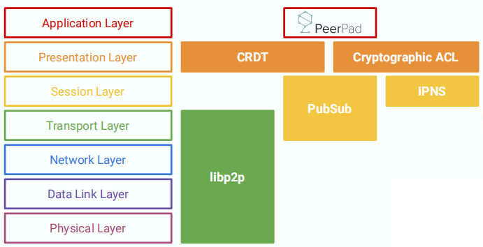
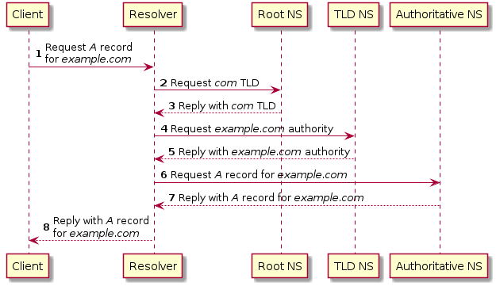
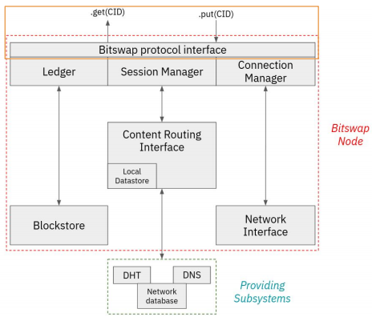
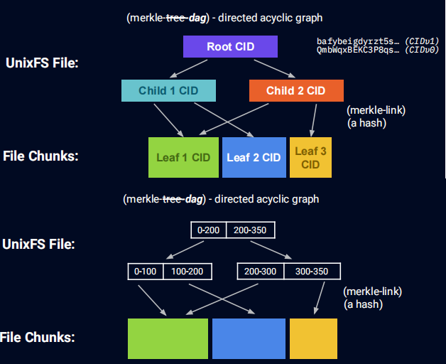
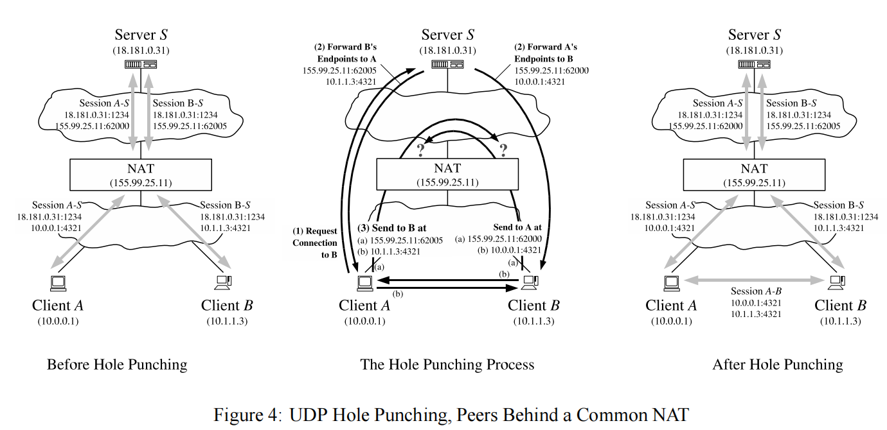

+++
title = "IPFS与web2.0的简单比较"
[taxonomies]
tags = [ "Linux" ]
+++

对IPFS技术的好奇，源于2点
- 已有经验，原来做视频会议时有p2p的通话，多人会议就是多p2多p(基于WebRTC的SFU)。
- web3.0的好奇，通过IPFS检验订正下自己设计一套网络系统的能力

历史成因  
  1. 2008年中本聪对英国政府增发货币不满，认为国家不发币也可以规避通货膨胀带来的恶果，就开发了[比特币](https://bitcoin.org)
  2. 2010年[Vitalik](https://vitalik.ca)对暴雪擅自削弱魔兽世界里术士的魔法，担心中心化服务的问题，2013年开发了[以太坊](https://ethereum.org)
  3. 2014年以太坊的[Gavin Wood](https://gavwood.com)提出web3.0(去中心化、互通增强、所有权)
  4. 2014年开始由Juan Benet设计IPFS，后由[Protocol Labs](https://protocol.ai/)在开源社区的帮助下发展起来

本篇文章思考和写作是基于
- 与web2.0的比较（将中心化的功能拆装到每个peer中）
- 参考通俗畅达的[IPFS的教程](https://research.protocol.ai/tutorials/resnetlab-on-tour/)

## 自上而下的网络流程
```
网上有一道高频面试题：浏览器从输入网址到页面展示的过程？
```
网上的讨论结果和详细解答很多，很多人正是基于此题把还给老师的网络原理课又借了回来不准备还了。

我想究其原因，网络原理细节丛生，多课程交叉，多数内容不易于用语言(老师和书)描述，所以很多图解xxx的书收视率一直居高不下，也确实是很适合人脑。

说到IPFS原理，提供了很多文档和宣传，但都没有整合如网络课本的系统，初看时被其宣传放大的优点牵引，细节蔓延。遇到向别人解释时，就变成讲故事讲案例了。

我想顺着自上而下的网络流程和基于中心化网络的比较，能更适合人脑理解吸收。

这道题的答案是
- URL输入
- DNS解析寻址
- 建立TCP连接
- 发送HTTPS请求
- 服务器响应请求
- 浏览器解析渲染页面
- HTTPS请求结束，断开TCP连接

重点要解释URL、DNS、HTTP、TLS、TCP和渲染的细节，这些技术的产生的背景和约束，回过头来再系统概括之间的关系，其他非功能因素(效率、成本、安全、兼容)对系统的塑造，应该就能回答的比较完善了。

IPFS去中心化时这道题的答案与中心化时对比差异
- cid输入
- DHT寻址路由
- libp2p建立多个p2p连接
- 发送bitswap请求
- peers响应请求
- IPLD内容组合
- 浏览器解析渲染页面
- libp2p请求结束，断开连接

重点是内容寻址、内容路由、内容交换
1. 寻址内容，内容间互转换寻址，通过IPLD。不依赖底层协议
2. 链接内容，将内容之间的链接嵌入到该内容地址，通过Merkle DAG
3. 发现内容：分布式哈希表,Bitswap



## 输入地址 url基于位置与cid基于内容
```
http url: scheme://host.domain:port/path/filename

IPFS cidv1: <multibase-prefix><multicodec-cidv1><multicodec-content-type><multihash-content-address>
```
cid（ContentID）
 

```rs
// create cid by codec, raw:0x55, dag_pb:0x70, sha2_256:0x12
let cid = Cid::new_v1(0x55, Code::Sha2_256.digest(b"beep boop"));
let data = cid.to_bytes();
assert_eq!(cid, Cid::try_from(data).unwrap());
assert_eq!(
    cid.to_string(),
    "bafkreieq5jui4j25lacwomsqgjeswwl3y5zcdrresptwgmfylxo2depppq"
);

// create 2 multiaddr
let addr1 = "/ip4/127.0.0.1/tcp/1234".parse::<Multiaddr>().unwrap();
let addr2 = multiaddr!(Ip4([127, 0, 0, 1]), Udp(10500u16), Quic);
assert_eq!(addr1.to_string(), "/ip4/127.0.0.1/tcp/1234");
assert_eq!(addr2.to_string(), "/ip4/127.0.0.1/udp/10500/quic");
```

还记得初学url定义时，对":// : ? ="符号的盲茫，比操作系统里的路径地址(c:\Windows\System32\Drivers\etc\hosts)多的这些有啥用，不都是要定位资源吗？有了分布式资源的描述和查询的经验后，现在都习以为常了。

这还不够，去中心化下要加入更多描述信息，有一种要把http协议head里的内容搬进来的感觉。还是因为没有了中心后，cid得独立描述自己了，回到哲学就是"自由的选择要承担什么样的责任?"
以前要与中心服务器协商的编码、通讯格式等信息，要CID独自承担了。

最后还要以对人类不友好，对机器友好的方式hash表现出来。

具体细节见 [cid](https://github.com/multiformats/cid), [multiformats](https://github.com/multiformats/multiformats)

## 寻址路由 DNS基于权威和DHT基于个人
 

### DNS的路由包括
- 找自己的缓存hosts
- 找DNS的缓存
- 找Root DNS
- 找Top layer DNS
- 找权威的DNS

同法院申诉流程(方便记忆)

具体细节参见[自己实现一个DNS](https://github.com/EmilHernvall/dnsguide/blob/master/chapter1.md) rust版

DNS还有一种HttpDNS的实现，为了及时更新路由表

DNS中心化后就有了被污染、被钓鱼和缓存中毒的安全问题

### DHT(Distributed Hash Table)的路由
 

- 结构：DHT的路由表是前缀树组成，基于位置的分组
- 行为：4种消息来定位和加入网络，PING、STORE、FIND_NODE和FIND_VALUE
- 启动：本地DHT启动时会建立路由表<peerid,multiaddr>，按距离构造成树结构
- 更新：此后DHT会通过熟人peers找到更近的peeers更新路由，
- 提供发现：同时将自己也作为服务公开出去，方便别人能找到，使用MDNS实现
- 路由：并行从近到远找，基于树的路由,节点k个桶（带有该前缀的节点列表）
- 内容发现：联系与CID最近的对等点。如果有对象就发送回，如果没有就响应提供者记录。
  - 对等点发现：对等点可能不知道提供者记录中对等点的多地址，因此它需要执行一个新的DHT查询来查找对等点的网络地址。
  - 路由表每10分钟刷新一次。这通常决定了是否需要一次新的步行来获得对等人的联系信息。
  - 对等点路由：使用提供者的多地址与它联系

参考[协议细节](http://bittorrent.org/beps/bep_0005.html)

DHT也有另一种实现，Gossip路由，基于热点聚合，路由更快但就不稳定。libp2p可以动态选择这些协议算法。

DHT也有DNS的安全问题，只是多个中心peers后，攻击的成本变大了。

与DNS相比，IPFS不只是找到IP/peerID，还要增加找ContentID和同步Content，这些不属于DHT，后面会提到。

#### IPFS与Web2.0间的网关
- _dnslink用来在web2.0下访问web3.0
```sh
❯ dig +noall +answer TXT \_dnslink.docs.ipfs.tech
_dnslink.docs.ipfs.tech. 0      IN      CNAME   _dnslink.ipfs-docs.on.fleek.co.
_dnslink.ipfs-docs.on.fleek.co. 0 IN    TXT     "dnslink=/ipfs/QmTcCaXT7drCnfJhQmt7HAvT9PwT1XMsXVcHL7nyRqgvbc"
```

- IPNS subdomain

```sh
> echo "Hello again IPFS" > hello.txt
> ipfs add hello.txt

> added QmaVfeg2GM17RLjBs9C4fhpku6uDgrEGUYCTC183VrZaVW hello.txt
> 17 B / 17 B [=====================================================] 100.00%

> ipfs name publish QmaVfeg2GM17RLjBs9C4fhpku6uDgrEGUYCTC183VrZaVW

> Published to k51qzi5uqu5dkkciu33khkzbcmxtyhn376i1e83tya8kuy7z9euedzyr5nhoew: /ipfs/QmaVfeg2GM17RLjBs9C4fhpku6uDgrEGUYCTC183VrZaVW

> curl https://gateway.ipfs.io/ipns/k51qzi5uqu5dkkciu33khkzbcmxtyhn376i1e83tya8kuy7z9euedzyr5nhoew
> Hello again IPFS
```


### 内容路由流程
IPFS特有的基于内容的路由
- 内容不会被复制到其他peer，这些内容保存在用户的设备上
- 保存方式：CID作为指针指向其他peer的内容
- 保存地点：这个指针添加到20个peer保存
- 保存时间：24小时后过期失效
- 保存延续：12小时后由提供者重新发布，确保近20个对等者接收到内容，成为临时提供者

基于IPLD原理
- multihash：指向文件的Merkle-DAG
- 文件分块：文件被分割成块，每个Chunk可独立寻址独立hash。去重，也可减小体积，分段传输
- 文件连接：每个块都表示为一个节点连接到Merkle DAG，块的哈希是节点的地址，地址都嵌在父节点中，作为链接。merkle-link
- 文件结构生成：IPLD Graph基于Merkle-DAG构建结构的标准和格式，从根开始并拆分为目录和文件。
- 抗内容重复：文件被分割成块，每个Chunk可独立寻址独立hash。去重，也可减小体积，分段传输

## 建立连接 TCP和p2p

相同点：
- 通讯：基于应答确认方式
- 安全：基于附加加密通道，TLS等
- 复用：可以复用连接，用完后不关闭，其他CID会话继续使用

p2p不同点：
- 组合获取，同时从多个peers服务中获取不同的cid资源组合在一起
- NAT穿越，多个内网设备独立与外网设备连接
- Pubsub，peer间双工通信

libp2p作为独立成熟库，以及为多个应用服务了，功能繁多，有多种语言绑定，先不用细究
- Transport
- NAT Traversal
- Secure Communication
- Circuit Relay
- Protocols
- Peer Identity
- Content Routing
- Peer Routing
- Addressing
- Security Considerations
- Publish/Subscribe
- Stream Multiplexing

## 发送bitswap请求


协议
- Requests: WANT-HAVE / WANT-BLOCK / CANCEL
- Responses: HAVE / BLOCK / DONT_HAVE

基于内容的交换，是IPFS特有。
目的是在多个peer间同步内容资源，依赖的还是IPLD结构化

为了找到有文件的节点，运行 Bitswap 协议的节点首先向它连接的所有节点发送一个名为 want-have 的请求。这个需要的请求包含文件根块的 CID（根块位于组成文件的块的 DAG 的顶部）。具有根块的对等方发送有响应并被添加到会话中。没有阻止的对等方发送没有响应。 Bitswap 构建了一个DAG图，显示哪些节点拥有和不拥有每个区块。



基于内容的发现
- bitswap问数据列表中的所有“邻居”：找积极响应者
- 迭代DHT找到更接近目标。提供者记录包括提供者的PeerID和MultiAddr
- 如果提供者记录指向其他提供者的多addrs，请启动一个位交换会话 
- DHT再次映射：PeerID->多Addr。重复：1
- 缓存内容，发布提供程序记录，在被要求时提供内容

### Graphsync方式的交换对比
功能               | Bitswap             | Graphsync       |
------------------ | ------------------ | ---------------- |
Protocol type      | Message-oriented   | Request-Response
Content exchange   | Block by block     | Stream
Request patterns   | CID Path           | IPLD Selector
Multi-path download| Yes                 | No, 1:1 exchange
Use cases          | Block exchange,Accelerate content routing |Blockchain sync,Large dataset sync

扩展功能
- 压缩
- WANT等消息检查
- 多跳内容发现

## IPLD内容组合


原理借鉴git

动手实验下，一个文件的[IPLD DAG化](https://dag.ipfs.io/)

## 端到端穿透打洞

两台不同网络下的电脑互通，可能中间隔了一个或多个NAT，我们常觉得有了对方的ip直接connect就可以了，tcp的syn发过去对方一定能回，结果等来的是超时，原因是电脑不知道对方看到自己的ip不是自己认为的ip，就是因为NAT转换的缘故，NAT可以基于port或ip将内部多个ip转到外部的一个ip。



libp2p中实现端到端穿透NAT的实现在autonat.rs中，有3次不同的尝试
1. 先直连检测能否成功
2. 不行就广播外部的电脑朋友告诉自己的外部ip，然后两台电脑打洞，告诉NAT缓存自己和对方的信息，两台NAT之间互通后就能让两台电脑互通
3. 最后一招，用两台电脑都认识的第3方电脑做中继

代码里流程
```rs
// client的swarm轮询每台电脑，根据反馈升级行为

loop {
    match swarm.select_next_some().await {
        SwarmEvent::NewListenAddr { address, .. } => ...,
        SwarmEvent::Behaviour(event) => ...,
    }
}

Stream.poll_next
  poll_next_event(
    match this.pool.poll(cx) 
        Behaviour
          handle_pool_event(
              .inject_connection_established(

// NetworkBehaviourEventProcess.inject流入到 poll函数的最前面
#[derive(NetworkBehaviour)]
#[behaviour(event_process = true)]
struct MyBehaviour {
    floodsub: Floodsub,
    mdns: Mdns,
}

NetworkBehaviourAction.handle_behaviour_event
  match {Dial,NotifyHandler,ReportObservedAddr,CloseConnectio}
```

还有一个开源的端到端加密通讯库可参考
[ockam](https://github.com/build-trust/ockam)