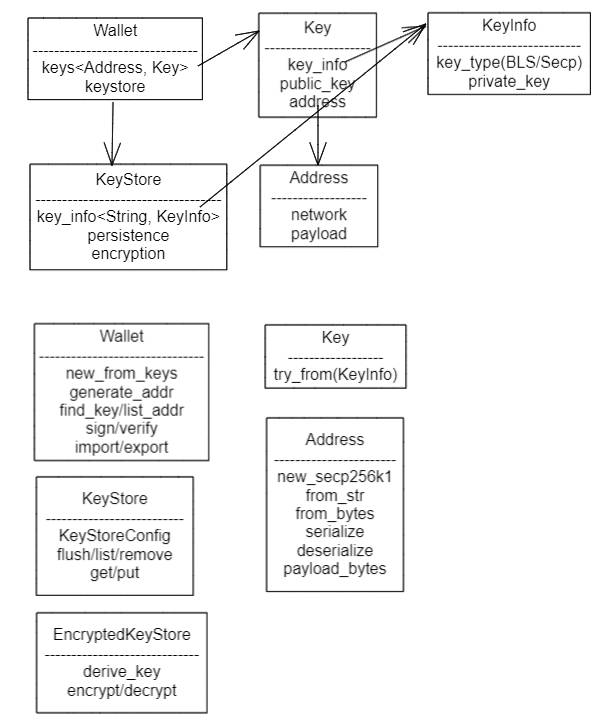

+++
title = "Forest的daemon、cli流程和钱包结构"
[taxonomies]
tags = [ "Blockchain" ]
+++

去年了解过Filecoin，对其Go版的实现lotus运行和分析过，源于对IPFS的兴趣。

今年学习零知识证明时，简单过了下ref_fvm，同时分析Filecoin的Rust版forest时，提交2个小PR，都是关于wallet的。顺带记录了些学习笔记如下。

### 钱包的功能需求
- 挣钱：新区块的签名，转账时签名
- 收钱：老区块的验签，接收转账时验签

### 钱包功能的约束
- 多设备：导入多出在设备之间
- 多账户：增删改查多个账户

### 账户的基本结构
- 私钥：分BLS聚合签和Secp256k1椭圆算法签名
- 公钥：对外提供的标识
- 地址：可视文本化的公钥

### wallet结构
- Wallet { keys<Address, Key>, keystore }
- Key { KeyInfo, public_key, address }
- KeyInfo { key_type, private_key }
- Address { Net(main/test), payload(ID/Secp256k1/Actor/BLS) }
- KeyStore { key_info<addr, KeyInfo>, persistence, encryption }


### wallet 子命令的流程
```
> forest [wallet list | state lookup]

解析参数        *_cmd.rs [wallet_cmd | state_cmd ]
构造jsonrpc参数 *_opt.rs [wallet_opt | state_opt ]

call() -> jsonrpc: 
  reqest object   { version, method, params, id }
  response object { version, result, error, id }

key_mangement/wallet.rs
  list_addr() // 从KeyStore或state里获取
```
改动的部分是参照lotus再list时能输出除Address外，还有此Address的Balance、Nonce、Default

将原来的list调用组合了对KeyStore的获取和state中的Balance的获取，但因json API中输出类型都是一个String，暂且去掉了Nonce。

## 还有1个bug在分析中

- 有如下会输出错乱
```log
 2022-0X INFO  forest::daemon         > Using network :: testnetnet
 2022-0X INFO  genesis                > Importing chain from snapshot
 2022-0X INFO  genesis                > Reading file...
Importing snapshot 3.34 GB / 3.91 GB [===============>--------
Importing snapshot 3.34 GB / 3.91 GB [======================================-] 85.73 % 2.35
Importing snapshot 3.39 GB / 3.91 GB [=
Importing snapshot 3.
ImportingScanning blockchain 1079961 / 1086061 [============] 99.44 % 116.94/s 52s  
 2022-0X INFO  genesis                > Accepting [Cid
```

- 也有bad_block引起的循环不停的Bootstrapping
```log
ERROR chain_sync::chain_muxer   > Bootstrapping failed, re-evaluating the network head to retry the bootstrap. Error = 
 TipsetRangeSyncer(Validation("Validation error: Consensus error: StateManager error: failed to find state tree xxx "))
```

### daemon的启动流程
- start
  - read keystore
  - start promithus
  - print token
  - init db
  - chain_store, publish, set_genesis
  - genesis, tipset, read_genesis_head
- libp2p
- mpoll
- consensus
- chainMuxer
- p2p

#### 其中主要的task
- mining
- prometheus
- p2p
- rpc
- sync: chainMuxer

##### bad_block check
```sh
❯ ./target/release/forest --import-snapshot ./lotus_cali_snapshot_2022_07_01_high_1086060.car
WARN  forest::cli > No configurations found, using defaults.
INFO  forest::daemon > Starting Forest daemon, version v0.2.2/alpha/2777962b
INFO  forest_libp2p::service > Recovered libp2p keypair from "/root/.local/share/forest/libp2p/keypair"
Enter the keystore passphrase:
INFO  forest::daemon         > Prometheus server started at 127.0.0.1:6116
INFO  forest::daemon         > Admin token: eyJ0eXAiOiJKV1QiLCJhbGciOiJIUzI1NiJ9.eyJBbGxvdyI6WyJyZWFkIiwid3JpdGUiLCJzaWduIiwiYWRtaW4
INFO  genesis                > Initialized genesis: BlockHeader: Cid(bafy2bzacecnamqgqmifpluoeldx7zzglxcljo6oja4vrmtj7432rphldpdmm2)
INFO  forest::daemon         > Using network :: testnetnet
INFO  genesis                > Importing chain from snapshot
INFO  genesis                > Reading file...
Importing snapshot 3.34 GB / 3.91 GB [===============>--------
Importing snapshot 3.34 GB / 3.91 GB [======================================-] 85.73 % 2.35
Importing snapshot 3.39 GB / 3.91 GB [=
Importing snapshot 3.
ImportingScanning blockchain 1079961 / 1086061 [============] 99.44 % 116.94/s 52s  
INFO  genesis                > Accepting [Cid(bafy2bzaced3lqekadp5wwveksrfq3ulh43eq36gtgqqdsksfqfarb7aujncne), Cid(bafy2bzacedizgfupmw3loypx2dcczgaykmymzrnovupegthmwnbsslfsov4ua), Cid(bafy2bzaced4jfbzyol4qft4h4tkacco77z6aa2m4qkm573xanmyv3jdjier2m)] as new head.
ERROR forest::cli            > Error: Database too old. Download a snapshot from a trusted source and import with --import-snapshot=[file]
```

```sh
Starting Forest daemon
Recovered libp2p keypair from "/root/.local/share/forest/libp2p/keypair"
...
chain_muxer: Bootstrapping failed, re-evaluating the network head to retry the bootstrap. Error = TipsetRangeSyncer(Validation("Validation error: Consensus error: StateManager error: failed to find state tree bafy2bzacebbm4ympalhar75tlczmwpg3xkrh5txt56dluvam65it334zg5gke"))

chain_muxer: Bootstrapping failed, 重复尝试并不停报错
```
还在分析中，抽空攒个大块时间处理